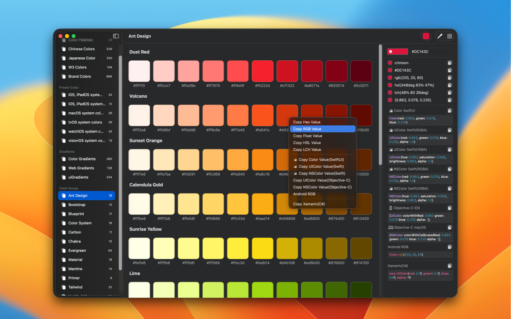

	 
	 
  
	<h1>Palette Genius</h1>
  <!--rehype:style=border: 0;-->
  

		<a href="./README.zh.md">中文</a> • 
    <a target="_blank" href="https://apps.apple.com/app/palette-genius/6472593276">AppStore</a> • 
		<a target="_blank" href="https://wangchujiang.com/#/contact">Contact & Support</a> • 
    <a href="https://github.com/jaywcjlove/palette-genius/releases">Changelog</a>
  

  

    
  

PaletteGenius is a screen color picker tool designed to improve efficiency for designers and developers.

Why do I need to develop this application?

✦ I have always been using the built-in color picker in my system. It is compact and fast, but it has noticeable drawbacks. It cannot display hexadecimal values and it is not easy to copy and convert to other color formats.

✦ Collect popular colors, including colors from popular component libraries and standard color values.

✦ Rich color code formats: covering mainstream platforms and programming languages (iOS, Android, Swift, Objc, CSS, etc.), with keyboard shortcuts for quick code copying.

✦ Appearance: supporting light and dark modes.