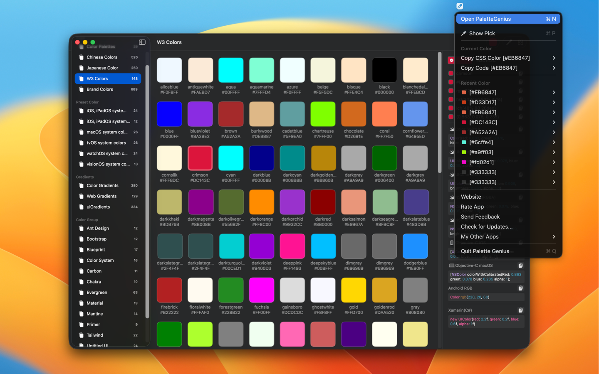

	 
	 
	
  

		<a href="./README.md">English</a> • 
    <a target="_blank" href="https://apps.apple.com/app/palette-genius/id6472593276">AppStore</a> • 
		<a target="_blank" href="https://wangchujiang.com/#/contact">联系&支持</a>
  

	<h1>Palette Genius</h1>
  <!--rehype:style=border: 0;-->
  

    
    
  

PaletteGenius 是一款旨在提高设计师和开发者效率的屏幕颜色选择工具。

为什么需要开发这个应用程序呢？

✦ 我一直在使用系统内置的颜色选择器。它既紧凑又快速，但它也有明显的缺点。它无法显示十六进制值，并且不容易复制并转换为其他颜色格式。

✦ 收集流行的颜色，包括来自流行组件库和标准颜色值的颜色。

✦ 丰富的颜色代码格式：涵盖主流平台和编程语言（iOS、Android、Swift、Objc、CSS 等），并提供快速代码复制的键盘快捷键。

✦ 外观：支持浅色和深色模式。